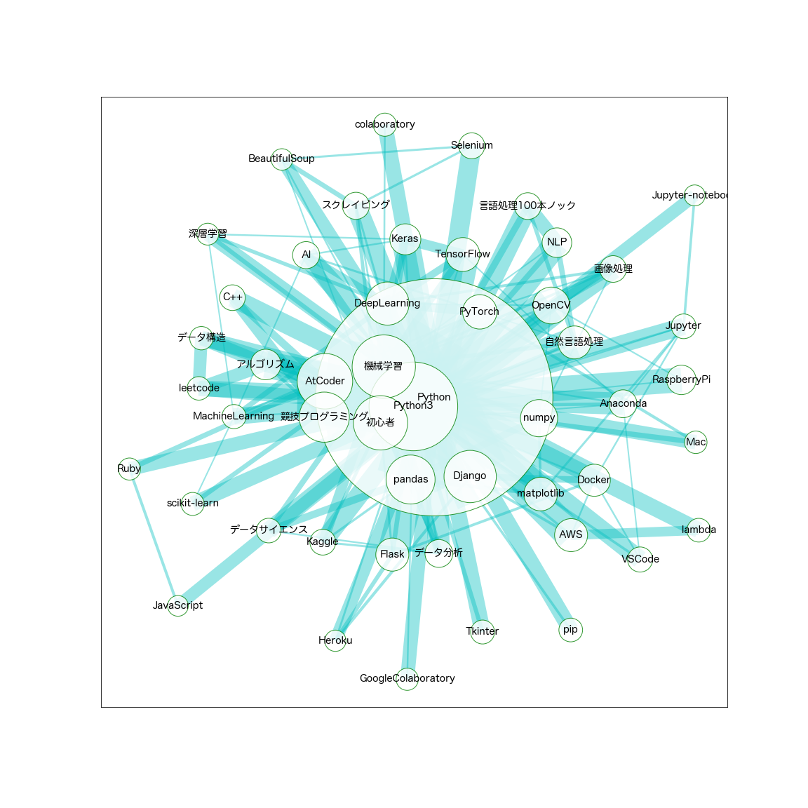

# Qiita Analysis

provides easy methods to
* get Qiita articles items,
* create tag network graph

## try here

[](https://mybinder.org/v2/gh/gsy0911/qiita_analysis/master?filepath=sample%2Fpublic_sample.ipynb)

## installation

```shell script
$ pip install git+https://github.com/gsy0911/qiita_analysis#egg=qiita-analysis
```

## Example

* To get Qiita article items:

```python

from datetime import datetime, timedelta
import json
from qiita_analysis import QiitaClient, QiitaItemBox

client = QiitaClient(qiita_token="qiita_token")

# set start_date and end_date
start_date = datetime.fromisoformat("2020-01-01")
end_date = datetime.fromisoformat("2020-01-31")

days = (end_date - start_date).days
for d in range(days + 1):
    target_date = (start_date + timedelta(days=d)).strftime("%Y-%m-%d")
    print(target_date)
    data = client.get_item_at(target_date)
    # store to QiitaItemBox
    item_box = QiitaItemBox()
    item_box.extend(data)
    
    # or save to local
    with open(f"./{target_date}.json", "w") as f:
        json.dump(item_box.dumps(True), f, indent=4)
```

* To create tag networkgraph

```python

import glob
from qiita_analysis import QiitaItemBox

# list files you saved before
file_list = glob.glob("./2020/*.json")
# load file list
item_box = QiitaItemBox()
item_box.extend_files(file_list)

img = item_box.create_tag_graph(tags=["Python"], common_n=50, weight_more_than=10)
img.savefig("Python.png")
```

the result is like



# thanks to

* [Qiita API v2](https://qiita.com/api/v2/docs)
* [GiNZA](https://github.com/megagonlabs/ginza)
* [NetworkX](https://github.com/networkx/networkx)
* [seaborn](https://github.com/mwaskom/seaborn)

